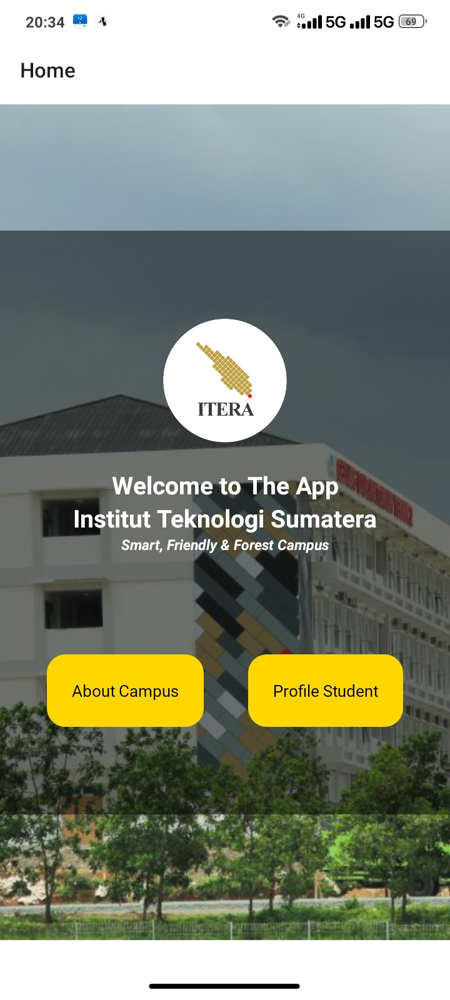

# Apps Itera 
# UTS-PAM-IRSAN ROMARDI HARAHAP-120140043-RA

# [Github Link IRSAN ROMARDI HARAHAP_120140043 UTS PAM RA](https://github.com/Irsannerha/UTS-PAM-2023)

# [LINK DOWNLOAD APLIKASI DAN BUKTI ScreenShoot Aplikasi](https://drive.google.com/drive/folders/1sGxi2_uTdl1FR5l3Vhs6BVVNU2-nho1H?usp=share_link

# [Link Laporan Pengerjaan UTS PAM RA](https://docs.google.com/document/d/1Im9m07lAUwMq5S-TnVpnsK71ZYqidMZO/edit?usp=share_link&ouid=100926777651239262199&rtpof=true&sd=true)

## Deskripsi 
Aplikasi sederhana 
 
 - Tampilan Halaman Home 
 
 - Tampilan Halaman Profile Mahasiswa
 
 - Tampilan Halaman About Campus

| 120140043 | IRSAN ROMARDI HARAHAP